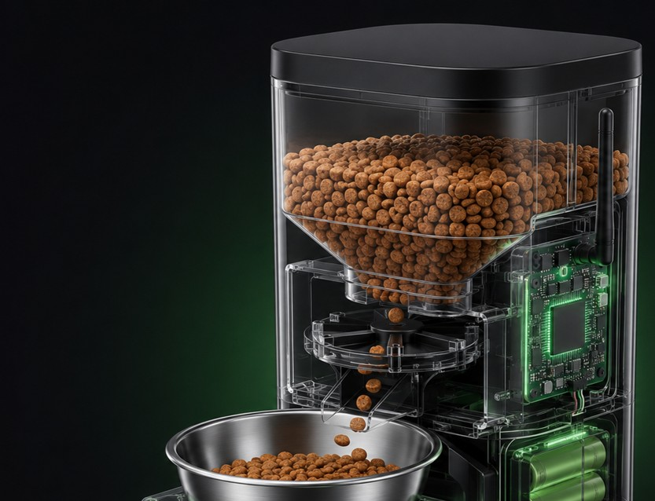

# Технические детали

## Аппаратная архитектура

| Уровень | Компоненты | Функции |
| :--- | :--- | :--- |
| **Устройство** | Контейнер, дозатор, миска, датчик веса, зуммер | Выдача порции, локальная индикация |
| **Контроллер** | ESP32-C3, RTC DS3231, flash-память | Расписание, управление мотором, журнал событий |
| **Связь** | BLE, Wi-Fi, HTTPS/TLS | Первичная настройка и синхронизация |
| **Backend** | API, база данных, сервис уведомлений | История, статусы, push/Telegram |
| **Интерфейс** | Приложение или Telegram-бот | Расписание, ручной запуск, уведомления |

## Ключевые компоненты

* **ESP32-C3:** Обеспечивает Wi-Fi и Bluetooth Low Energy (BLE) для связи со смартфоном.
* **RTC DS3231:** Высокоточные часы, которые позволяют кормушке работать по расписанию даже без интернета.
* **Датчик веса HX711 + тензодатчик:** Позволяет с точностью до ±5 грамм проверить, что корм действительно попал в миску.
* **Шаговый мотор + драйвер:** Управляет дозирующим механизмом, обеспечивая точную выдачу порции.
* **Резервное питание:** Встроенный аккумулятор позволяет устройству работать при отключении электричества.