# Лабораторная работа №1. Основы контейнеризации с Docker

## 1. Цель работы

Изучить базовые концепции контейнеризации с использованием Docker.

Научиться:

- устанавливать Docker;
- работать с Docker-образами;
- создавать и запускать контейнеры;
- управлять контейнерами (остановка, запуск, удаление);
- использовать тома (volumes) для сохранения данных.

---

## 2. Оборудование и программное обеспечение

- **Операционная система:** Windows 10 (версия 10.0.2600.9168) с WSL2.
- **Docker Desktop** (версия, установленная по умолчанию).
- **Терминал:** командная строка Windows (cmd).

---

## 3. Ход выполнения работы

### 3.1. Проверка установки Docker и запуск тестового контейнера

После установки Docker была выполнена проверка работоспособности с помощью команды:

```bash
docker run hello-world
```

Контейнер успешно запустился, выведя приветственное сообщение.

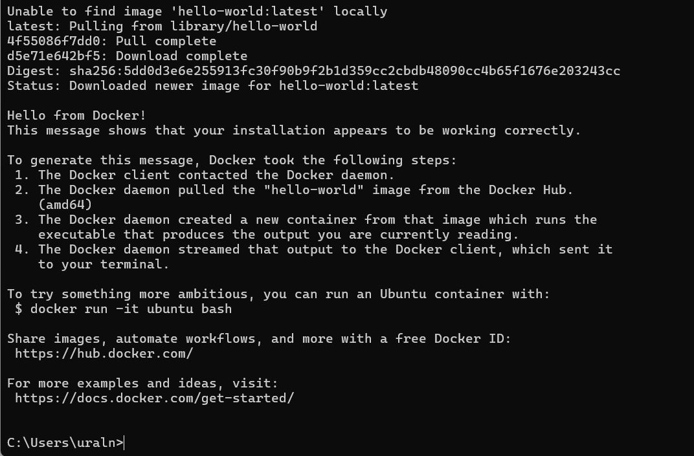

Команда `docker images` показала, что образ `hello-world` был загружен.

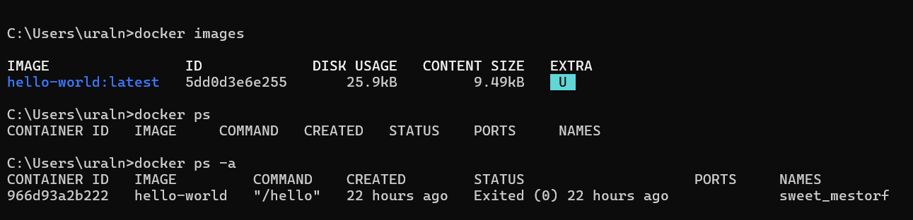

---

### 3.2. Работа с готовыми образами (Ubuntu)

#### 3.2.1. Загрузка образа Ubuntu

Образ Ubuntu был загружен из Docker Hub командой:

```bash
docker pull ubuntu:latest
```

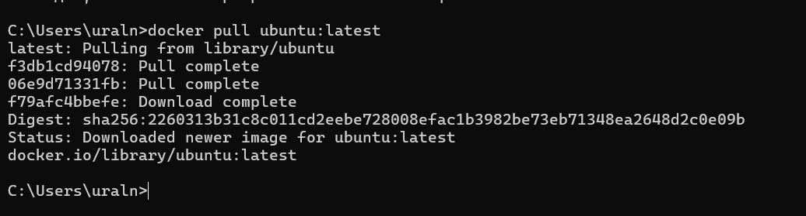

#### 3.2.2. Запуск интерактивного контейнера и установка curl

Контейнер был запущен в интерактивном режиме:

```bash
docker run -it ubuntu bash
```

Внутри контейнера выполнена установка пакета `curl`:

```bash
apt update && apt install -y curl
```

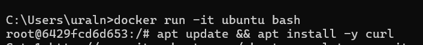

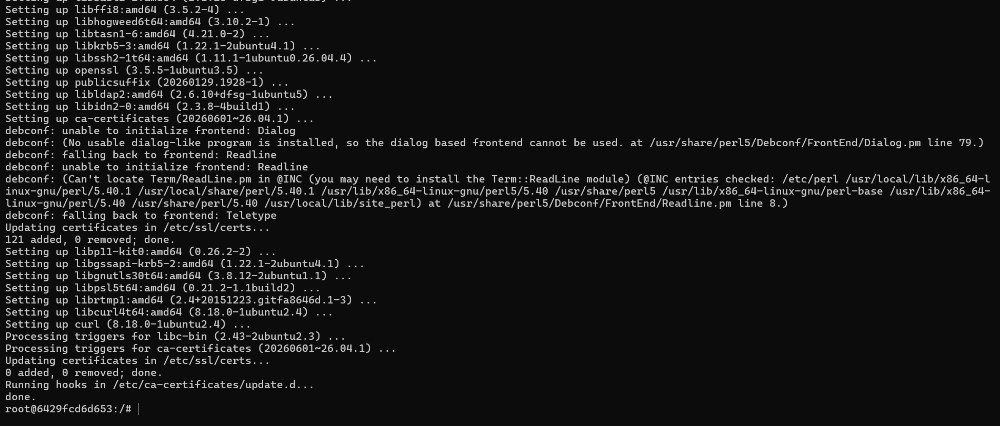

Успешность установки проверена командой `curl --version`.

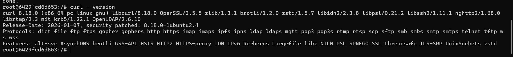

Выход из контейнера выполнен командой `exit`.

---

### 3.3. Запуск веб-сервера nginx

#### 3.3.1. Запуск контейнера с nginx

Контейнер с `nginx:alpine` был запущен в фоновом режиме с пробросом порта 8080 хоста на порт 80 контейнера:

```bash
docker run -d -p 8080:80 --name web-server nginx:alpine
```

Образ был автоматически загружен.

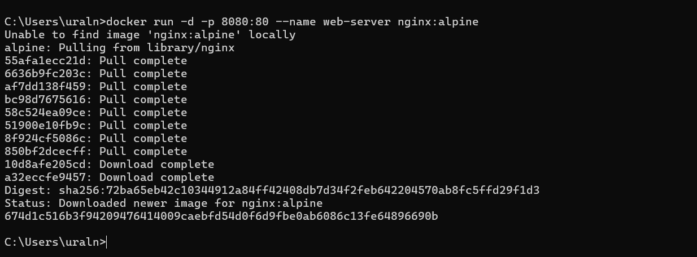

#### 3.3.2. Проверка работы в браузере

В браузере по адресу <http://localhost:8080> отобразилась стартовая страница nginx, что подтверждает корректный запуск.

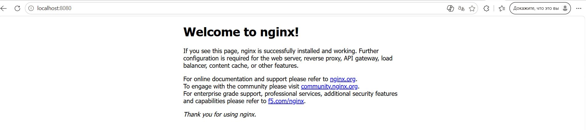

#### 3.3.3. Просмотр логов

Логи контейнера были выведены командой:

```bash
docker logs web-server
```

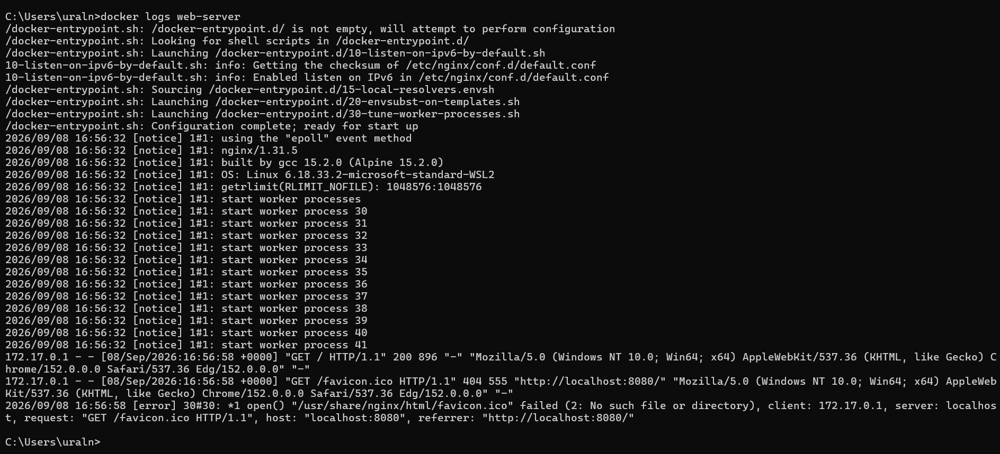

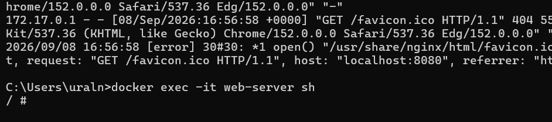

#### 3.3.4. Подключение к контейнеру

Выполнено подключение к запущенному контейнеру в режиме оболочки:

```bash
docker exec -it web-server sh
```

Затем выход из оболочки.

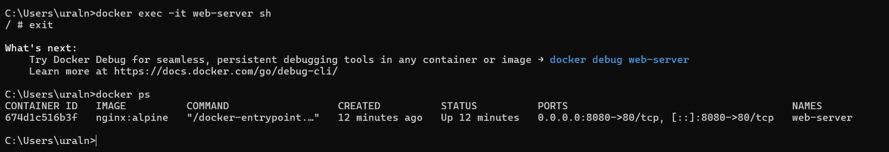


#### 3.3.5. Просмотр всех контейнеров

Команда `docker ps -a` показала все контейнеры, включая остановленные.

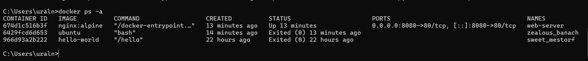

---

### 3.4. Управление контейнерами

#### 3.4.1. Остановка и запуск контейнера

Контейнер `web-server` был остановлен, а затем запущен заново:

```bash
docker stop web-server
docker start web-server
```
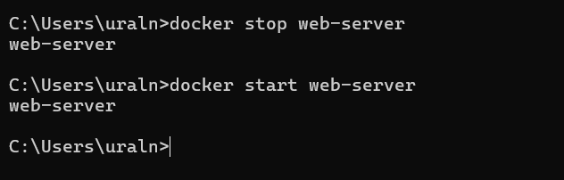

#### 3.4.2. Удаление контейнера

Попытка удалить работающий контейнер привела к ошибке, поэтому сначала он был остановлен, а затем удалён.

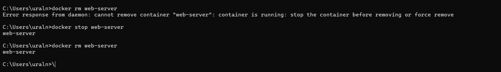

#### 3.4.3. Удаление образа

Образ `nginx:alpine` был удалён командой:

```bash
docker rmi nginx:alpine
```

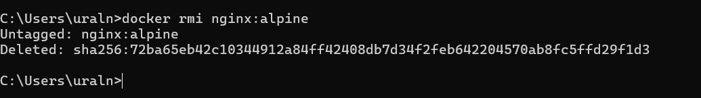

---

### 3.5. Работа с томами (volumes)

#### 3.5.1. Создание тома и запуск контейнера с томом

Создан том `my-volume`:

```bash
docker volume create my-volume
```

Затем запущен контейнер `volume-test` с монтированием этого тома в `/data`:

```bash
docker run -it --name volume-test -d -v my-volume:/data ubuntu bash
```

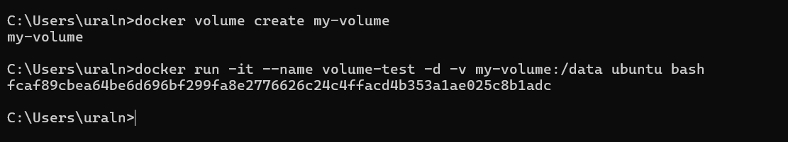

#### 3.5.2. Создание файла в томе

Подключились к контейнеру:

```bash
docker exec -it volume-test bash
```

Создали файл `test.txt` внутри смонтированной директории:

```bash
echo "Hello from volume" > /data/test.txt
```

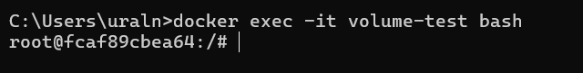
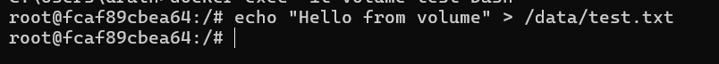
#### 3.5.3. Остановка и удаление контейнера

Контейнер `volume-test` был остановлен и удалён.

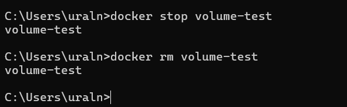

#### 3.5.4. Проверка сохранности данных

Создан новый контейнер `volume-test1` с тем же томом:

```bash
docker run -it --name volume-test1 -d -v my-volume:/data ubuntu bash
```

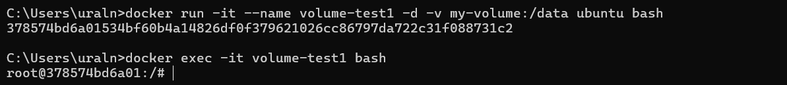

Подключились к нему и проверили наличие файла:

```bash
ls /data
```

Файл `test.txt` присутствует. Содержимое файла проверено с помощью:

```bash
cat /data/test.txt
```

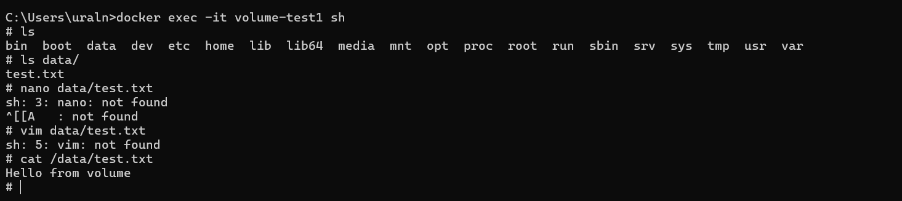

---

## 4. Выводы

В ходе выполнения лабораторной работы были изучены основные команды Docker:

- запуск и остановка контейнеров;
- работа с образами (`pull`, `run`, `rmi`);
- подключение к контейнерам в интерактивном режиме;
- использование томов для сохранения данных между пересозданиями контейнеров.

Установка Docker выполнена успешно, все команды отработали корректно.

Была продемонстрирована работа веб-сервера nginx в контейнере, а также проверена персистентность данных с использованием Docker volumes.

Таким образом, цель лабораторной работы достигнута, основные навыки работы с Docker освоены.
