# Отчёт по лабораторной работе №3

## «Мониторинг с Prometheus и Grafana»

---

## 1. Цель работы

Научиться настраивать локальную систему мониторинга на основе **Prometheus** (сбор метрик) и **Grafana** (визуализация). Освоить:

- конфигурацию Prometheus через `prometheus.yml`;
- запуск Node Exporter для сбора системных метрик;
- связку контейнеров через пользовательскую docker-сеть;
- настройку источника данных и построение дашбордов в Grafana.

---

## 2. Оборудование и программное обеспечение

- **ОС:** Windows 10 (10.0.26200.9168) с WSL2.
- **Docker Desktop:** containerd v2.1+.
- **Образы:** `prom/prometheus:latest`, `prom/node-exporter:latest`, `grafana/grafana:latest`.
- **Браузер:** Microsoft Edge.
- **Инструмент нагрузки:** `jess/stress`.

---

## 3. Ход выполнения работы

### 3.1. Создание конфигурации Prometheus

Создана папка `prometheus`, в ней через «Блокнот» открыт файл `prometheus.yml` для редактирования:

```powershell
cd prometheus
notepad prometheus.yml
```

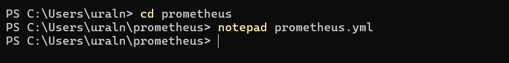

В файл записано:

```yaml
global:
  scrape_interval: 15s

scrape_configs:
  - job_name: 'prometheus'
    static_configs:
      - targets: ['localhost:9090']

  - job_name: 'node-exporter'
    static_configs:
      - targets: ['node-exporter:9100']
```

### 3.2. Запуск Node Exporter

Контейнер Node Exporter запущен с монтированием системных директорий хоста в режиме read-only:

```powershell
docker run -d --name node-exporter --restart=unless-stopped -p 9100:9100 -v "/proc:/host/proc:ro" -v "/sys:/host/sys:ro" -v "/:/rootfs:ro" prom/node-exporter --path.procfs=/host/proc --path.rootfs=/rootfs --path.sysfs=/host/sys --collector.filesystem.mount-points-exclude="^/(sys|proc|dev|host|etc)($|/)"
```

Образ `prom/node-exporter:latest` был автоматически скачан, контейнер получил ID `54844f33b09a`.

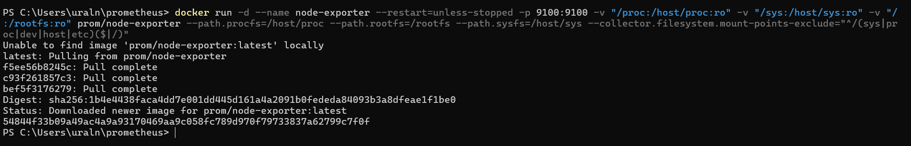

**Проверка работы:** выполнена команда `curl http://localhost:9100/metrics`. PowerShell запросил подтверждение безопасности (`Invoke-WebRequest` — риск выполнения сценария), после ответа `y` получен ответ:

```text
StatusCode : 200
Content-Type: text/plain; version=0.0.4; charset=utf-8
RawContentLength : 130541
```

В теле ответа — метрики `go_gc_duration_seconds`, `go_goroutines` и другие.

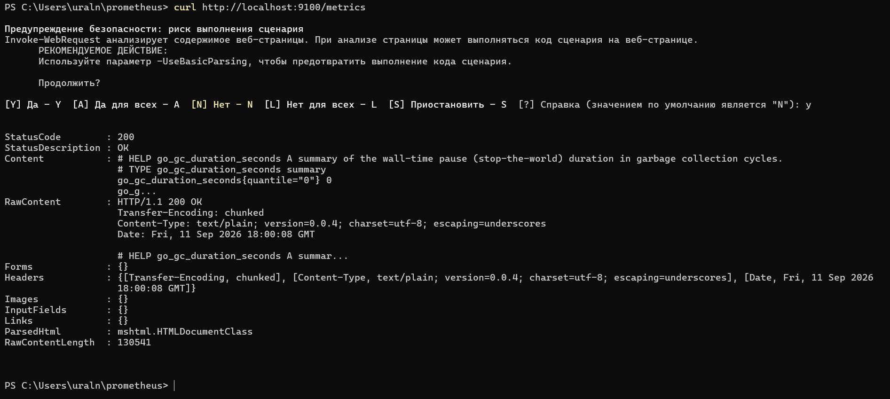

### 3.3. Запуск Prometheus

Созданы том и пользовательская сеть:

```powershell
docker volume create prometheus-data
docker network create monitoring
```

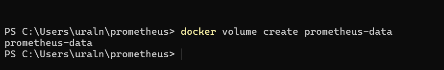
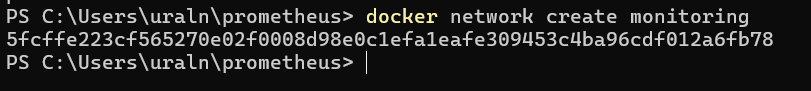

Запущен контейнер Prometheus из корневой папки проекта — на уровень выше `prometheus/` — с монтированием конфигурации и тома данных:

```powershell
docker run -d --name prometheus --network monitoring --restart=unless-stopped -p 9090:9090 -v prometheus-data:/prometheus -v ${PWD}/prometheus:/etc/prometheus prom/prometheus --config.file=/etc/prometheus/prometheus.yml --storage.tsdb.path=/prometheus --web.console.libraries=/etc/prometheus/console_libraries --web.console.templates=/etc/prometheus/consoles --storage.tsdb.retention.time=200h --web.enable-lifecycle
```

Образ скачан, контейнер получил ID `52f350ebbdb3`.

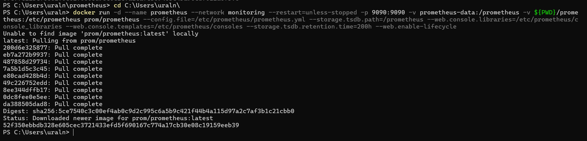

**Проверка:** открыт [http://localhost:9090](http://localhost:9090) — веб-интерфейс Prometheus доступен, вкладка **Query** пока пустая («No data queried yet»).

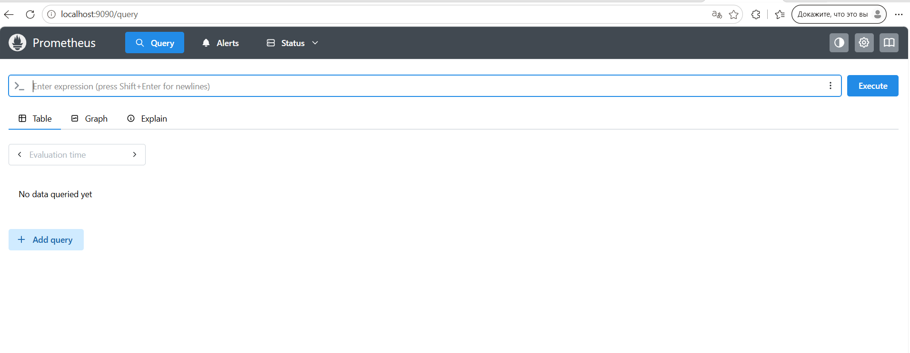

**Проверка таргетов:** открыт [http://localhost:9090/targets](http://localhost:9090/targets) — оба таргета в статусе **UP**:

| Job | Endpoint | Last scrape | State |
|-----|----------|-------------|-------|
| `node-exporter` | `http://node-exporter:9100/metrics` | 13.485s ago | **UP** |
| `prometheus` | `http://localhost:9090/metrics` | 3.118s ago | **UP** |

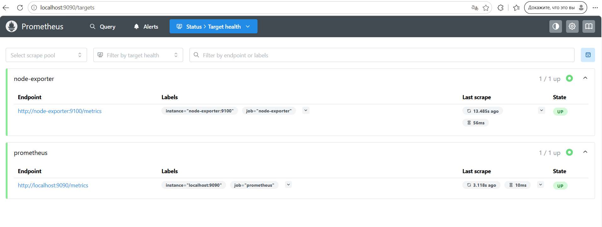

### 3.4. Диагностика сети и подключение Node Exporter

После запуска Prometheus обнаружено, что в сети `monitoring` находятся только `prometheus` и `grafana`, а `node-exporter` — нет. Проверка:

```powershell
docker network inspect monitoring --format '{{range .Containers}}{{.Name}} {{end}}'
# → prometheus grafana
```

Это объясняло, почему таргет `node-exporter` первоначально мог быть DOWN. Проблема устранена подключением контейнера к сети и перезапуском Prometheus:

```powershell
docker network connect monitoring node-exporter
docker restart prometheus

# Проверка после исправления:
docker network inspect monitoring --format '{{range .Containers}}{{.Name}} {{end}}'
# → prometheus node-exporter grafana
```

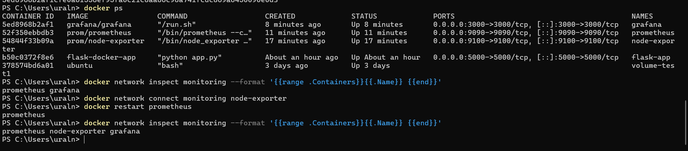

**Контейнеры после исправления:**

```text
CONTAINER ID   IMAGE                STATUS         PORTS                    NAMES
5ed8968b2af1   grafana/grafana      Up 8 minutes   0.0.0.0:3000->3000/tcp   grafana
52f350ebbdb3   prom/prometheus      Up 11 minutes  0.0.0.0:9090->9090/tcp   prometheus
54844f33b09a   prom/node-exporter   Up 17 minutes  0.0.0.0:9100->9100/tcp   node-exporter
```


### 3.5. Запуск Grafana

Создан том и запущен контейнер:

```powershell
docker volume create grafana-data

docker run -d --name grafana --network monitoring --restart=unless-stopped -p 3000:3000 -v grafana-data:/var/lib/grafana -e "GF_SECURITY_ADMIN_PASSWORD=admin" grafana/grafana
```

Образ `grafana/grafana:latest` скачан

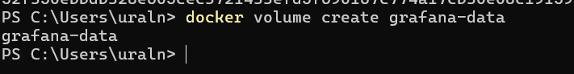
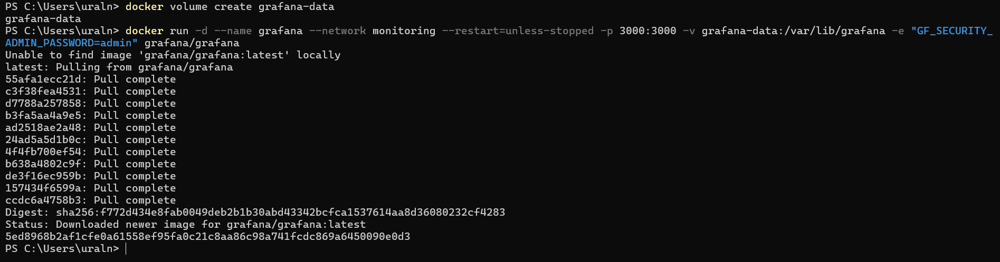

**Проверка:** открыт [http://localhost:3000](http://localhost:3000) — отображается страница приветствия **Welcome to Grafana** с формой входа.

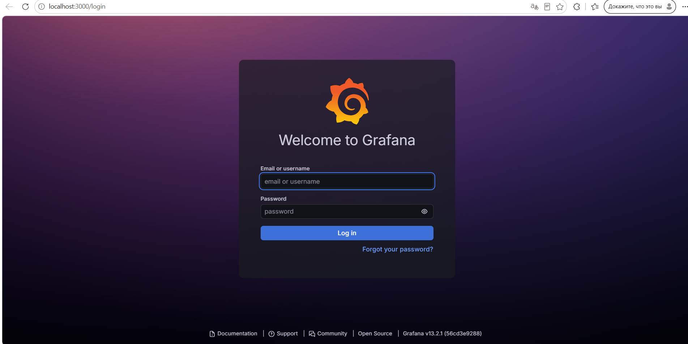

### 3.6. Настройка источника данных в Grafana

1. Открыт раздел **Connections → Data sources → Add data source**.
2. Выбран **Prometheus** (Type: Prometheus, Alerting: Supported).
3. В поле **Connection URL** указан адрес `http://prometheus:9090` — имя сервиса в сети `monitoring`, а не `localhost`.
4. Нажата кнопка **Save & test** — получено сообщение **Data source is working**.

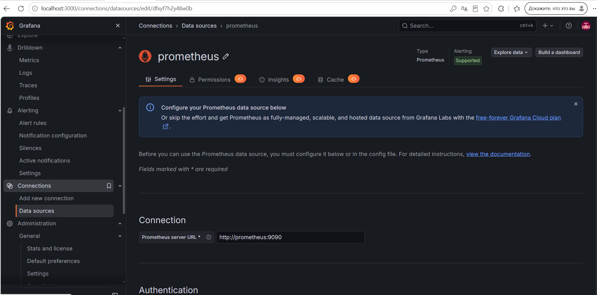

### 3.7. Создание дашбордов

Создан дашборд с несколькими панелями.

#### Панель 1. CPU Usage (%)

**PromQL:**

```promql
100 - (avg by (instance) (rate(node_cpu_seconds_total{mode="idle"}[5m])) * 100)
```

**Настройки панели:**

| Параметр | Значение |
|----------|----------|
| Panel title | CPU Usage (%) |
| Unit | percent (0-100) |
| Min | 0 |
| Max | 100 |
| Legend | Last *, Max * |

**Проверка:** при отсутствии нагрузки график плоский, значение `Last *: 0.682%`.

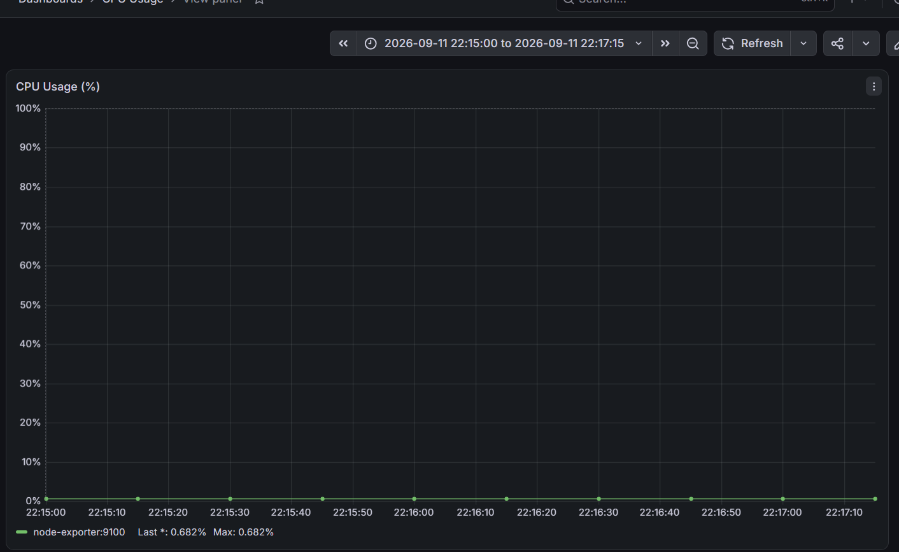

#### Панель 2. Memory Usage (%)

**PromQL:**

```promql
(1 - node_memory_MemAvailable_bytes / node_memory_MemTotal_bytes) * 100
```

**Настройки панели:**

| Параметр | Значение |
|----------|----------|
| Panel title | Memory Usage (%) |
| Unit | percent (0-100) |
| Min | 0 |
| Max | 100 |

**Проверка:** график показывает стабильное значение около 18% — график слегка растёт в диапазоне 17–19%.

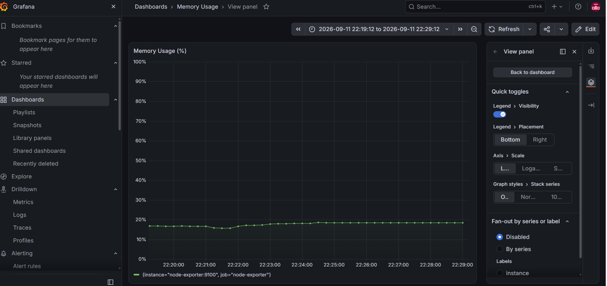

#### Панель 3. Disk Free (bytes)

**PromQL:**

```promql
node_filesystem_avail_bytes{fstype!~"tmpfs|overlay|squashfs"}
```

**Настройки панели:**

| Параметр | Значение |
|----------|----------|
| Panel title | Disk Free (bytes) |
| Visualization | Pie chart (круговая диаграмма) |
| Legend | `{{mountpoint}}` |

**Проверка:** на диаграмме видно распределение свободного места по точкам монтирования: `/mnt/docker-desktop-disk`, `/run/desktop/mnt/host/c`, `/var/lib`, `/mnt/host/c`, `/parent-distro/mnt/host/c` и другим.

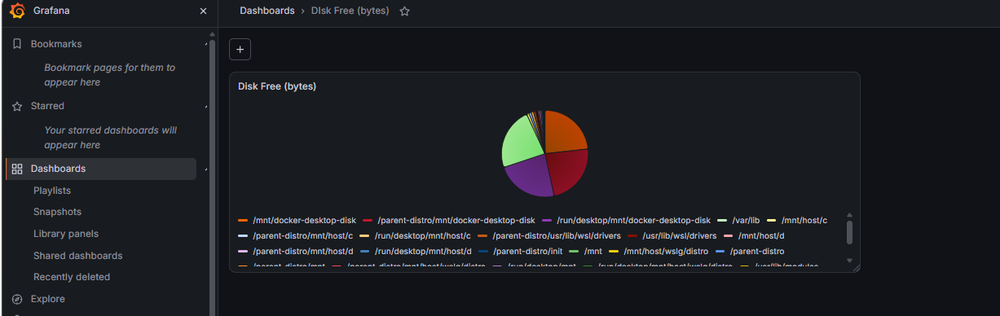

Дашборд сохранён через кнопку **Save → Dashboard saved**.

### 3.8. Тестирование системы под нагрузкой

Для проверки того, что график CPU реагирует на нагрузку, запущен нагрузочный контейнер:

```powershell
docker run --rm -it jess/stress --cpu 4 --timeout 60s
```

Вывод:

```text
stress: info: [1] dispatching hogs: 4 cpu, 0 io, 0 vm, 0 hdd
stress: info: [1] successful run completed in 60s
```

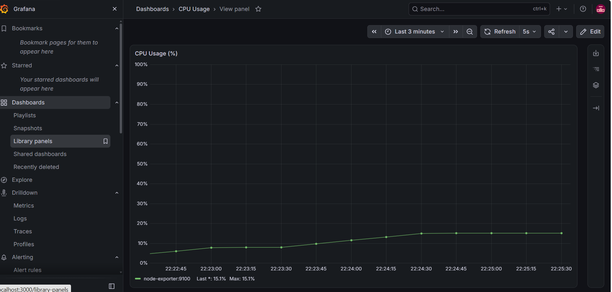

**Результат на графике CPU Usage:** при включённом автообновлении каждые 5 секунд на панели **CPU Usage (%)** виден рост с 5% до 15% в течение минуты:

- `Last *: 15.1%`, `Max: 15.1%` — в момент нагрузки;
- после завершения — возврат примерно к 0.7%.

Это подтверждает, что цепочка **Node Exporter → Prometheus → Grafana** работает корректно и реагирует на изменение состояния системы.

---

## 4. Итоговая схема мониторинга

```text
┌────────────────────┐        ┌──────────────────┐        ┌───────────────┐        ┌──────────┐
│  Node Exporter     │───────►│   Prometheus     │───────►│   Grafana     │───────►│ Браузер  │
│  :9100 /metrics    │  pull  │   :9090 (TSDB)   │ query  │   :3000 UI    │  HTTP  │          │
└────────────────────┘  15s   └──────────────────┘        └───────────────┘        └──────────┘
        ▲
        │ системные метрики (CPU, RAM, диск, сеть)
        │
   Хост-машина (Windows + WSL2)
```

Все три контейнера объединены в пользовательскую сеть `monitoring`.

---

## 6. Выводы

В ходе лабораторной работы была развёрнута полноценная система мониторинга:

1. **Prometheus** настроен на сбор метрик с двух источников: себя самого и Node Exporter. Оба таргета успешно опрашиваются с интервалом 15 секунд.
2. **Node Exporter** собирает системные метрики хост-машины в среде WSL2 и отдаёт их на порт 9100.
3. **Grafana** подключена к Prometheus через общую docker-сеть, что позволяет использовать DNS-имя сервиса вместо IP-адреса.
4. Построен дашборд с панелями: **CPU Usage (%)**, **Memory Usage (%)**, **Disk Free (bytes)** — круговая диаграмма.
5. Проверена работоспособность системы под нагрузкой: при запуске `jess/stress --cpu 4` на графике CPU наблюдался рост с 5% до 15%.
